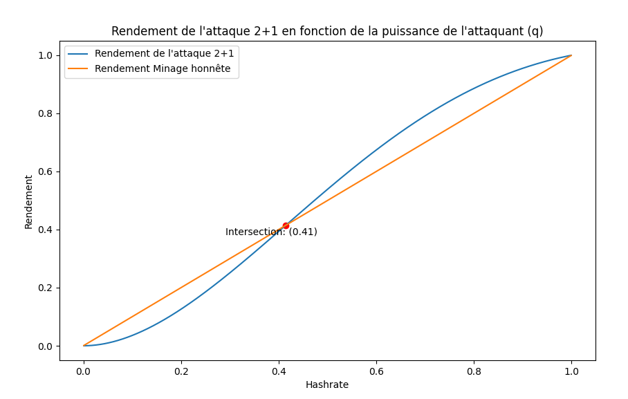

# Simulations d'attaques sur le Réseau Bitcoin

Ce dépôt contient des scripts Python qui simulent trois types d'attaques dans le réseau Bitcoin : Selfish Mining, Double Spending, et l'attaque 2+1. Ces simulations permettent d'analyser l'efficacité de chaque attaque et de comprendre leur impact sur le réseau.
Pour lancer une simulation, ouvrez le terminal et exécuter cette commande
``python3 ./selfishmining.py``

## Attaques Simulées

### 1. Attaque 2+1

**Objectif :**
Simuler une attaque durant trois blocs pour maximiser les récompenses du mineur.

**Mécanisme :**

- Si le premier bloc est trouvé par un mineur honnête, l'attaquant arrête et la simulation se termine.
- Si l'attaquant trouve le premier bloc, il continue à attaquer pour deux blocs supplémentaires.

**Stratégie :**

- **B** : Bob trouve le premier bloc.
- **AAA** : Alice trouve trois blocs successivement.
- **AAB** : Alice trouve les deux premiers blocs, mais Bob trouve le troisième.
- **ABA** : Alice trouve le premier et le troisième bloc, et Bob trouve le deuxième.
- **ABB** : Alice trouve le premier bloc, et Bob trouve les deux suivants.

**Gains :**
En fonction des probabilités, Alice peut maximiser ses récompenses en trouvant des blocs successivement et en annulant les blocs de Bob.

**Simulation:**

  

**Script:**
``attack_2_plus_1.py`` simule l'attaque 2+1 en utilisant les paramètres q (probabilité qu'Alice trouve un bloc), z (nombre de confirmations nécessaires), A (seuil de tolérance), et v (valeur de la double dépense). Le script calcule le rendement de l'attaque en fonction des probabilités de succès pour différentes configurations.

**Résultats:**

Pour l'attaque 2+1, on observe que l'attaque est rentable à partir de 41% de puissance de minage relative.

### 2. Double Spending

**Objectif :**
Dépenser les mêmes bitcoins deux fois, trompant ainsi un ou plusieurs destinataires.

**Mécanisme :**

- **Transaction Originale** : L'attaquant envoie une transaction légitime à un marchand.
- **Blocs Cachés** : Simultanément, l'attaquant commence à miner secrètement une chaîne de blocs alternative où la transaction légitime n'est pas incluse.
- **Réorganisation de la Chaîne** : Si l'attaquant réussit à miner une chaîne plus longue avant que la transaction soit suffisamment confirmée par le réseau honnête, il publie cette chaîne pour annuler la transaction initiale.
- **Deuxième Transaction** : L'attaquant dépense à nouveau les mêmes bitcoins dans une nouvelle transaction.

**Gains :**
L'attaquant réussit à annuler la transaction initiale après avoir reçu un montant en bitcoin, utilisant ainsi les mêmes bitcoins pour une deuxième transaction.

**Simulation:**

  

**Script:**

``double_spending.py``  simule une attaque par double dépense en utilisant les paramètres q (taux de hachage de l'attaquant), z (nombre de confirmations nécessaires), A (seuil de tolérance), k (nombre de blocs prémédités), v (valeur de la double dépense), et N (nombre de cycles d'attaque). Le script évalue le succès de l'attaque en fonction de ces paramètres.

**Résultats:**

Pour l'attaque Double Spending, on fait jouer différents paramètres mais on observe qu'en l'absence de connectivité (facteur connectivité=0), l'attaque n'est rentable qu'à partir de 44% de puissance de minage relative.

### 3. Selfish Mining

**Objectif :**
Maximiser la part de récompense de l'attaquant en manipulant la propagation des blocs dans le réseau.

**Mécanisme :**

- **Blocs Cachés** : L'attaquant mine des blocs mais ne les diffuse pas immédiatement.
- **Lead** : L'attaquant garde une longueur d'avance en termes de blocs minés.
- **Fork (Bifurcation)** : Si un mineur honnête trouve un bloc alors que l'attaquant a déjà un ou plusieurs blocs cachés, l'attaquant publie immédiatement ses blocs pour créer une bifurcation.
- **Override (Remplacement)** : Si l'attaquant a deux blocs cachés et qu'un mineur honnête en trouve un, l'attaquant publie ses blocs pour remplacer celui du mineur honnête.

**Gains :**
En maintenant une chaîne plus longue et en publiant les blocs stratégiquement, l'attaquant obtient une proportion de la récompense de bloc supérieure à son taux de hachage relatif.

**Simulation:**

  

**Script:**

``selfish_mining.py`` simule l'attaque de Selfish Mining en utilisant les paramètres q (probabilité qu'Alice trouve un bloc), N (nombre de cycles d'attaque), et gamma (probabilité qu'un bloc bifurqué soit miné par Alice). Le script compare le rendement de l'attaque avec le minage honnête.

**Résultats:**

Pour le selfish mining ou le minage égoiste, on observe que l'attaque peut être rentable à partir de 29% de puissance de minage relative. Cependant il y a d'autres règles sur la gestion de blocs orphelins qui peuvent être pris en compte et qui renforcent la robustesse du réseau.